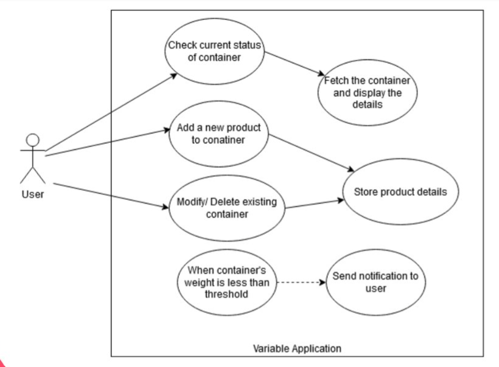

# Variable

## Introduction

Variable is a cylindrical shaped box that you can use to store your ingredients and other things in the kitchen. What makes it unique is the ability of the box to detect the weight of the substance contained in it and display it directly on your phone through an app. It also sends you text or alarms you if the substance contained in the box is about to be finished or below weight threshold.

## Use Case Diagram

## Test case video

[]

## Hardware needed

1. HX711 weight load
2. NodeMCU ESP8266
3. Arduino
4. A container to store your product

## Software Used
1. Flutter
2. Arduino IDE
3. Firebase

## Features
1. Weight detection: Variable can detect the weight of the substance contained in it and display it directly on your phone through an app.
2. Low weight alerts: Variable sends you text or alarms you if the substance contained in the box is about to be finished or below weight threshold.

